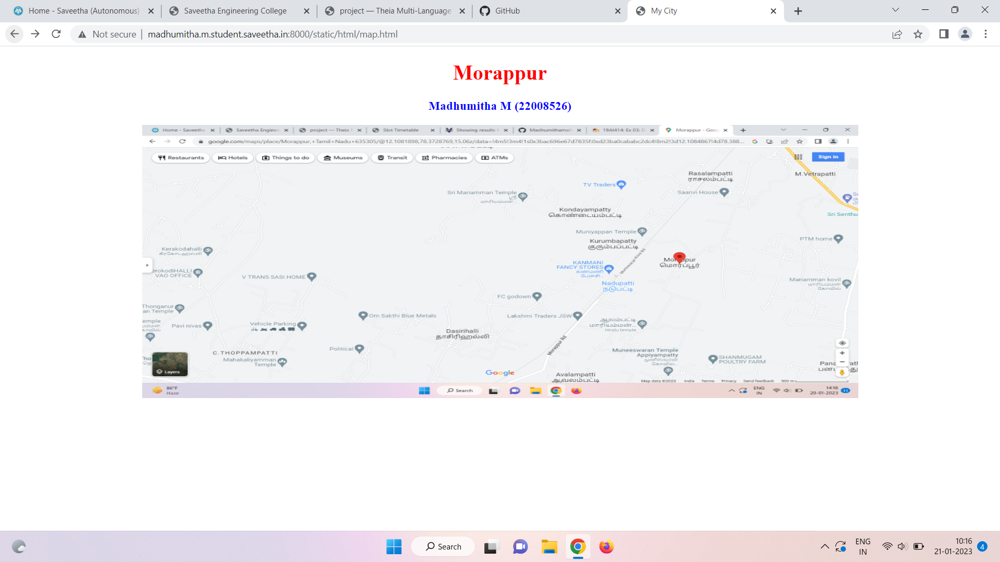
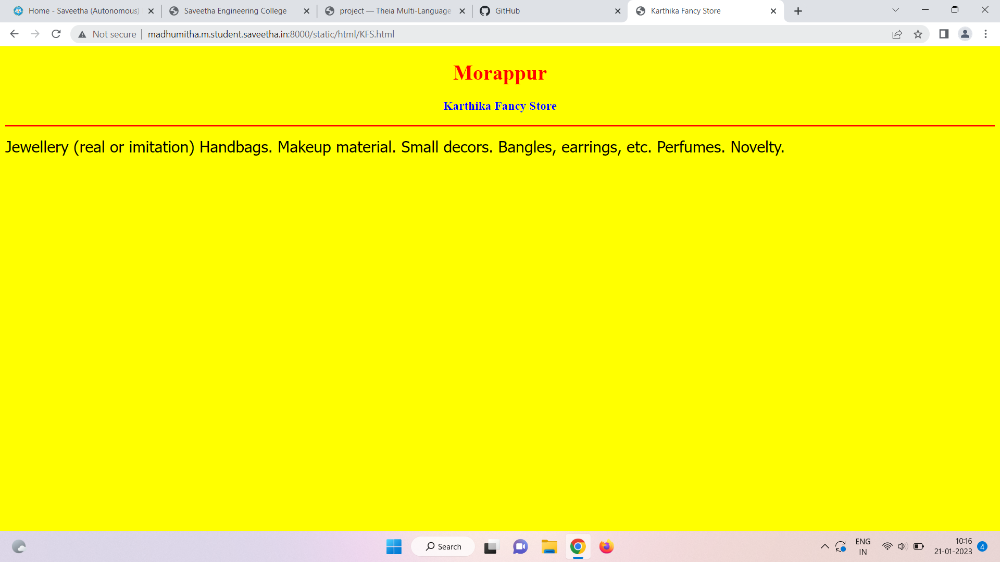
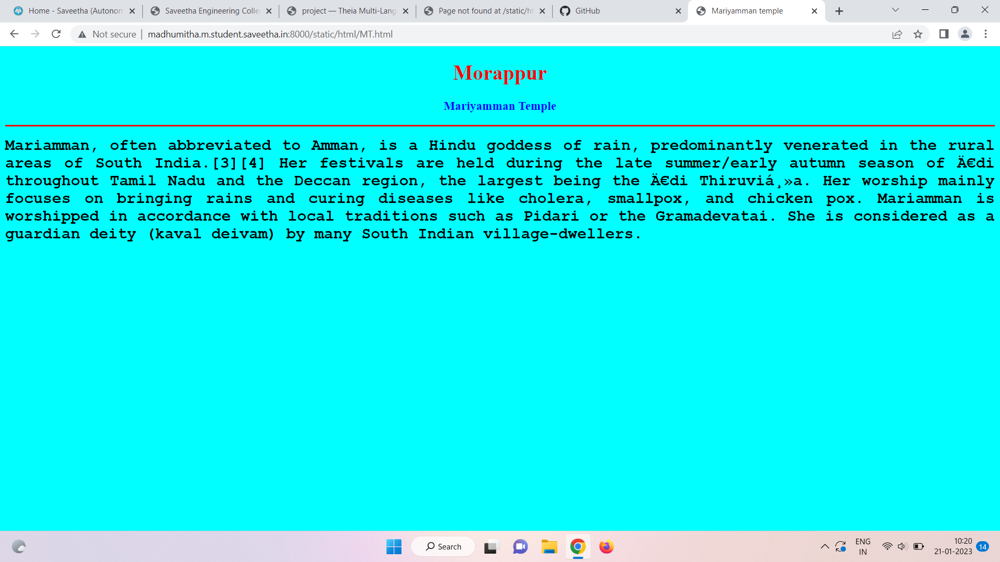
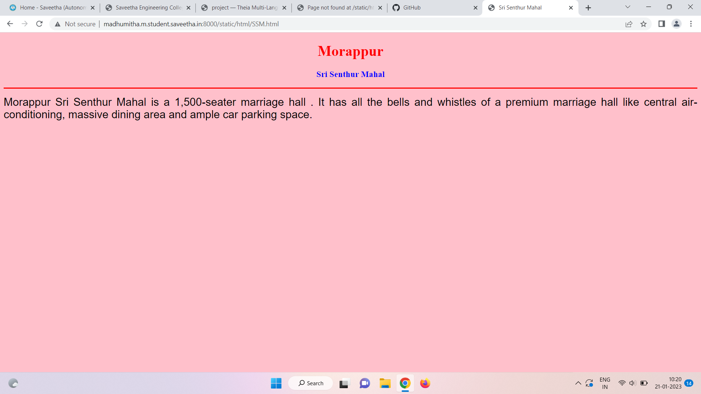
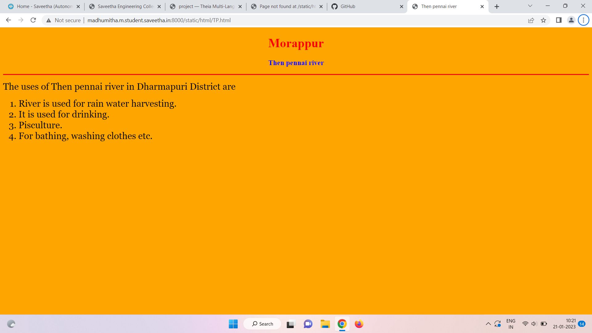

# Places Around Me
## AIM:
To develop a website to display details about the places around my house.

## Design Steps:

### Step 1:
Clone the github repository

### Step 2:
Execute and publish the result

## Code:
```
map.html
<!DOCTYPE html>
<html lang="en">
<head>
<title>My City</title>
</head><
<body>
<h1 align="center">
<font color="red"><b>Morappur</b></font>
</h1>
<h3 align="center">
<font color="blue"><b>Madhumitha M (22008526)</b></font>
</h3>
<center>

<map name="MyCity">
<area shape="circle" coords="190,50,20" href="/static/html/MT.html" title="Mariyamman Temple">
<area shape="rectangle" coords="230,30,260,60" href="/static/html/KFS.html" title="Karthika Fancy Store">
<area shape="circle" coords="400,350,50" href="/static/html/SSM.html" title="Sri Senthur Mahal">
<area shape="circle" coords="400,200,75" href="/static/html/Govt.High.Sec.School title="Government Higher Secondary School">
<area shape="rectangle" coords="490,150,870,320" href="/static/html/" title=TP river="Then pennai river ">
</map>
</center>
</body>
</html>

GHS.html
<!DOCTYPE html>
<html lang="en">
<head>
<title>Govt. High. Sec. School</title>
</head>
<body bgcolor="lime">
<h1 align="center">
<font color="red"><b>Morappur</b></font>
</h1>
<h3 align="center">
<font color="blue"><b>Government Higher Secondary School</b></font>
</h3>
<hr size="3" color="red">
<p align="justify">
<font face="Georgia" size="5">
The main objectives of morappur Government Higher Secondary School are 
<ul>
<li>To impart proper and qualified training to teachers and give them an attractive salary and incentives so that they are not tempted to quit and look elsewhere for jobs.</li>
<li>To provide financial aids and grants wisely and judiciously.</li>
<li>To Frame of syllabus and curriculum.</li>
<li>To set aims and objectives of education.</li>
</ul>
</font>
</p>
</body>
</html>

KFS.html
<!DOCTYPE html>
<html lang="en">
<head>
<title>Govt. High. Sec. School</title>
</head>
<body bgcolor="lime">
<h1 align="center">
<font color="red"><b>Morappur</b></font>
</h1>
<h3 align="center">
<font color="blue"><b>Government Higher Secondary School</b></font>
</h3>
<hr size="3" color="red">
<p align="justify">
<font face="Georgia" size="5">
The main objectives of morappur Government Higher Secondary School are 
<ul>
<li>To impart proper and qualified training to teachers and give them an attractive salary and incentives so that they are not tempted to quit and look elsewhere for jobs.</li>
<li>To provide financial aids and grants wisely and judiciously.</li>
<li>To Frame of syllabus and curriculum.</li>
<li>To set aims and objectives of education.</li>
</ul>
</font>
</p>
</body>
</html>

MT.html
<!DOCTYPE html>
<html lang="en">
<head>
<title>Mariyamman temple</title>
</head>
<body bgcolor="cyan">
<h1 align="center">
<font color="red"><b>Morappur</b></font>
</h1>
<h3 align="center">
<font color="blue"><b>Mariyamman Temple</b></font>
</h3>
<hr size="3" color="red">
<p align="justify">
<font face="Courier New" size="5">
<b>
Mariamman, often abbreviated to Amman, is a Hindu goddess of rain, predominantly venerated in the rural areas of South India.[3][4] Her festivals are held during the late summer/early autumn season of Ādi throughout Tamil Nadu and the Deccan region, the largest being the Ādi Thiruviḻa. Her worship mainly focuses on bringing rains and curing diseases like cholera, smallpox, and chicken pox. Mariamman is worshipped in accordance with local traditions such as Pidari or the Gramadevatai. She is considered as a guardian deity (kaval deivam) by many South Indian village-dwellers.
</b>
</font>
</p>
</body>
</html>

SSM.html
<!DOCTYPE html>
<html lang="en">
<head>
<title>Sri Senthur Mahal</title>
</head>
<body bgcolor="pink">
<h1 align="center">
<font color="red"><b>Morappur</b></font>
</h1>
<h3 align="center">
<font color="blue"><b>Sri Senthur Mahal</b></font>
</h3>
<hr size="3" color="red">
<p align="justify">
<font face="Arial" size="5"> 
Morappur Sri Senthur Mahal is a 1,500-seater marriage hall . It has all the bells and whistles of a premium marriage hall like central air-conditioning, massive dining area and ample car parking space.
<b>
</b>
</font>
</p>
</body>
</html>

TP.html
<!DOCTYPE html>
<html lang="en">
<head>
<title>Then pennai river</title>
</head>
<body bgcolor="orange">
<h1 align="center">
<font color="red"><b>Morappur</b></font>
</h1>
<h3 align="center">
<font color="blue"><b>Then pennai river</b></font>
</h3>
<hr size="3" color="red">
<p align="justify">
<font face="Georgia" size="5">
The uses of Then pennai river in Dharmapuri District are 
<ol type="1">
<li>River is used for rain water harvesting.</li>
<li>It is used for drinking.</li>
<li>Pisculture.</li>
<li>For bathing, washing clothes etc.</li>
</ol>
</font>
</p>
</body>
</html>
```

## Output:







## HTML Validator


## Result:
The program executed successfully